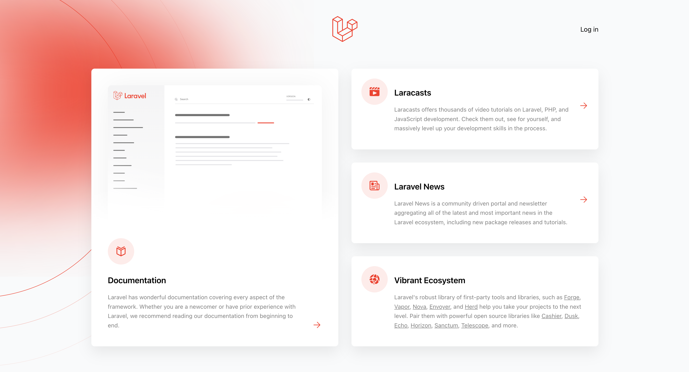
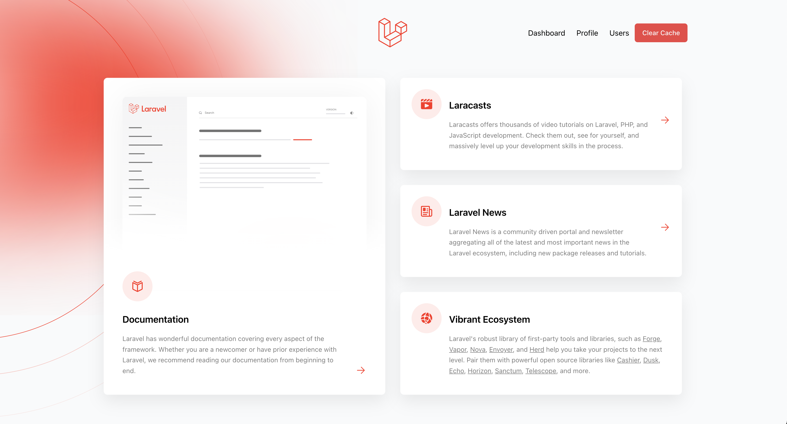
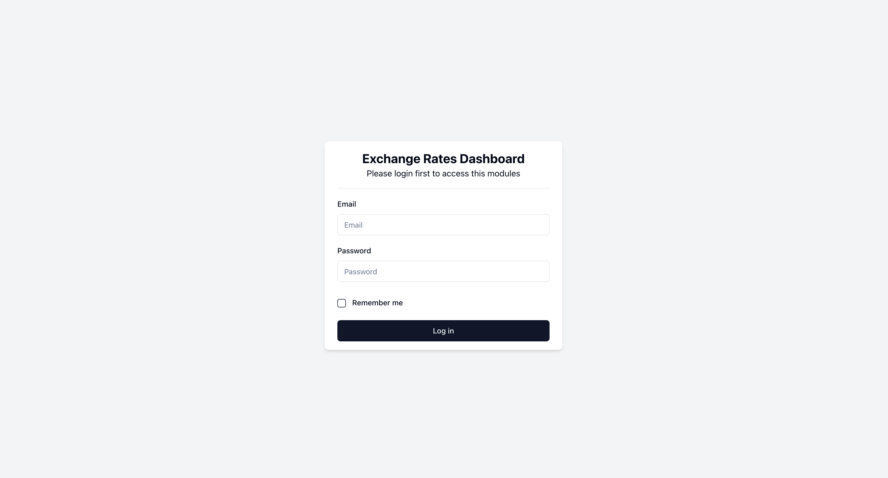
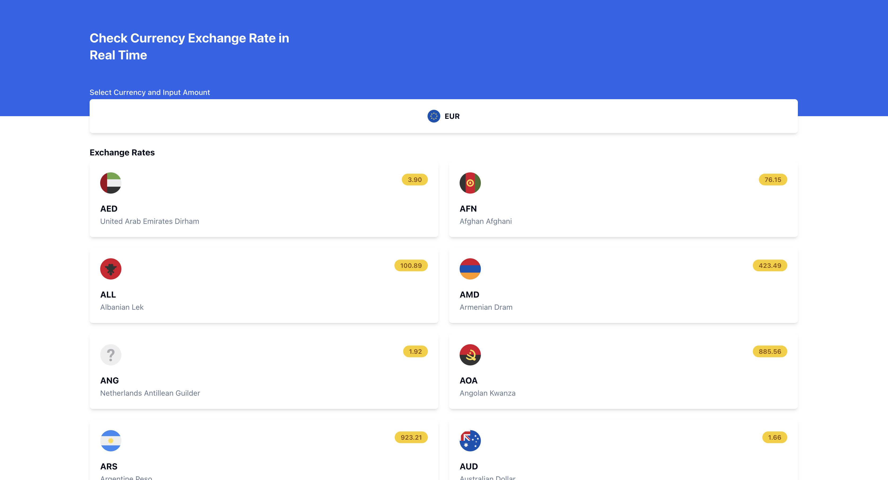
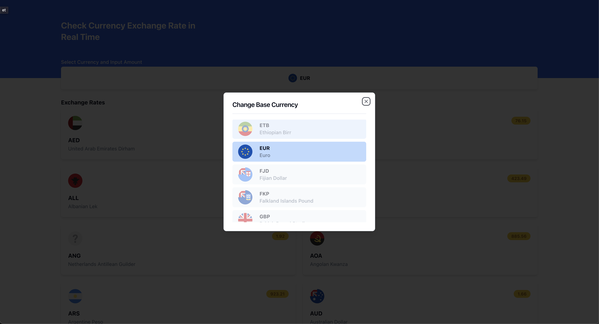
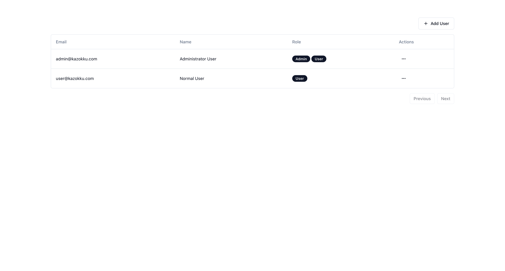
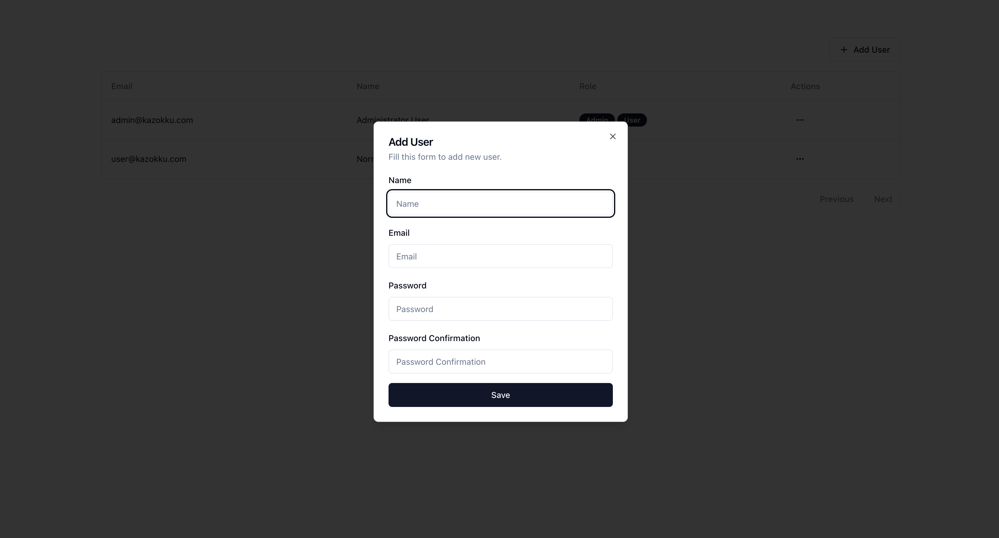
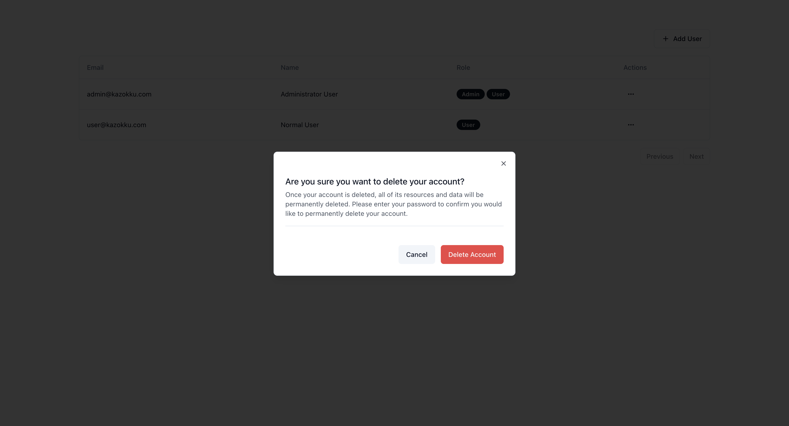
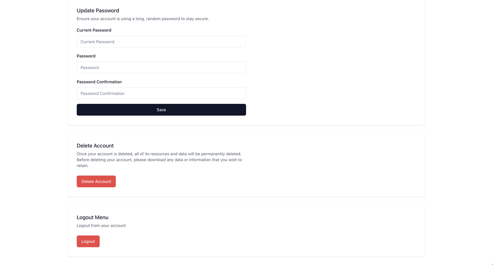

<p align="center"><a href="https://laravel.com" target="_blank"></a></p>

<p align="center">
<a href="https://github.com/laravel/framework/actions"></a>
<a href="https://packagist.org/packages/laravel/framework"></a>
<a href="https://packagist.org/packages/laravel/framework"></a>
<a href="https://packagist.org/packages/laravel/framework"></a>
</p>

# Dokumentasi Aplikasi

## Persyaratan Sistem

Pastikan sistem Anda memenuhi persyaratan berikut sebelum menginstal aplikasi:

- PHP versi minimum 8.3 telah terpasang.
- Node.js versi 20 telah terinstal.

## Clone Repositori

Clone repositori aplikasi ke dalam direktori lokal Anda:

```bash
git clone git@github.com:budiprihhastomo/kazokku-dashboard.git
```

## Konfigurasi Lingkungan

Salin file .env.example ke .env dan sesuaikan pengaturan lingkungan sesuai kebutuhan aplikasi Anda.


## Instalasi Dependensi

Instal semua dependensi PHP dan JavaScript dengan menjalankan perintah berikut:

```bash
composer install
npm install
```

## Migrasi Database

Sebelum menggunakan aplikasi, lakukan migrasi database dan seeding dengan menjalankan perintah:

```bash
./vendor/bin/sail up -d
./vendor/bin/sail artisan migrate --seed
```

## Evidence Untuk Aplikasi Yang Sudah Berjalan


















## List Route Table Aplikasi

| Method | URI                             | Controller                                         | Action                                            |
| ------ | ------------------------------- | -------------------------------------------------- | ------------------------------------------------- |
| GET    | HEAD  /                         | -                                                  | -                                                 |
| POST   | _ignition/execute-solution      | Spatie\LaravelIgnition\ExecuteSolutionController   | ignition.executeSolution › Spatie\LaravelIgnition |
| GET    | HEAD  _ignition/health-check    | Spatie\LaravelIgnition\HealthCheckController       | ignition.healthCheck › Spatie\LaravelIgnition     |
| POST   | _ignition/update-config         | Spatie\LaravelIgnition\UpdateConfigController      | ignition.updateConfig › Spatie\LaravelIgnition    |
| GET    | HEAD  admin/user                | UserController@index                               | user.index                                        |
| POST   | admin/user                      | UserController@store                               | user.store                                        |
| PATCH  | admin/user/{id}                 | UserController@update                              | user.update                                       |
| DELETE | admin/user/{id}                 | UserController@destroy                             | user.delete                                       |
| GET    | HEAD  api/symbols               | Api\CurrencySymbolController@index                 | currency.symbols                                  |
| GET    | HEAD  api/user                  | -                                                  | -                                                 |
| POST   | cache-clear                     | -                                                  | clear.cache                                       |
| GET    | HEAD  confirm-password          | Auth\ConfirmablePasswordController@show            | password.confirm                                  |
| POST   | confirm-password                | Auth\ConfirmablePasswordController@store           | -                                                 |
| GET    | HEAD  dashboard                 | DashboardController@show                           | dashboard                                         |
| POST   | email/verification-notification | Auth\EmailVerificationNotificationController@store | verification.send                                 |
| POST   | forgot-password                 | Auth\PasswordResetLinkController@store             | password.email                                    |
| GET    | HEAD  login                     | Auth\AuthenticatedSessionController@create         | login                                             |
| POST   | login                           | Auth\AuthenticatedSessionController@store          | -                                                 |
| POST   | logout                          | Auth\AuthenticatedSessionController@destroy        | logout                                            |
| PUT    | password                        | Auth\PasswordController@update                     | password.update                                   |
| GET    | HEAD  profile                   | ProfileController@edit                             | profile.edit                                      |
| PATCH  | profile                         | ProfileController@update                           | profile.update                                    |
| DELETE | profile                         | ProfileController@destroy                          | profile.destroy                                   |
| POST   | register                        | Auth\RegisteredUserController@store                | -                                                 |
| POST   | reset-password                  | Auth\NewPasswordController@store                   | password.store                                    |
| GET    | HEAD  reset-password/{token}    | Auth\NewPasswordController@create                  | password.reset                                    |
| GET    | HEAD  sanctum/csrf-cookie       | Laravel\Sanctum\CsrfCookieController@show          | sanctum.csrf-cookie                               |
| GET    | HEAD  up                        | -                                                  | -                                                 |
| GET    | HEAD  verify-email              | Auth\EmailVerificationPromptController             | verification.notice                               |
| GET    | HEAD  verify-email/{id}/{hash}  | Auth\VerifyEmailController                         | verification.verify                               |


## Kesimpulan

Aplikasi ini adalah sebuah sistem yang memungkinkan pengguna untuk melihat kurs mata uang yang terbaru. Dibangun dengan menggunakan kerangka kerja Laravel, aplikasi ini menawarkan beberapa fitur utama:

### Aksesibilitas Rute

Aplikasi menyediakan berbagai rute yang dapat diakses melalui HTTP verb seperti GET, HEAD, POST, PATCH, DELETE. Rute-rute ini mengarahkan pengguna ke fungsi-fungsi tertentu di dalam aplikasi, termasuk manajemen pengguna, dashboard, dan fungsi otentikasi.

### Manajemen Pengguna

Pengguna memiliki akses ke halaman administratif untuk manajemen pengguna. Mereka dapat melihat, menambahkan, memperbarui, dan menghapus pengguna sesuai kebutuhan.

### Pratinjau Aplikasi

Aplikasi dapat dijalankan dalam mode pratinjau menggunakan Laravel Sail (Dockerize), yang memungkinkan pengembang untuk melihat hasil kerja mereka sebelum diterapkan secara luas.

### Migrasi Database

Sebelum menggunakan aplikasi, pengguna harus melakukan migrasi database dan seeding. Ini memastikan struktur database yang diperlukan telah dibuat dan data awal telah dimasukkan.
